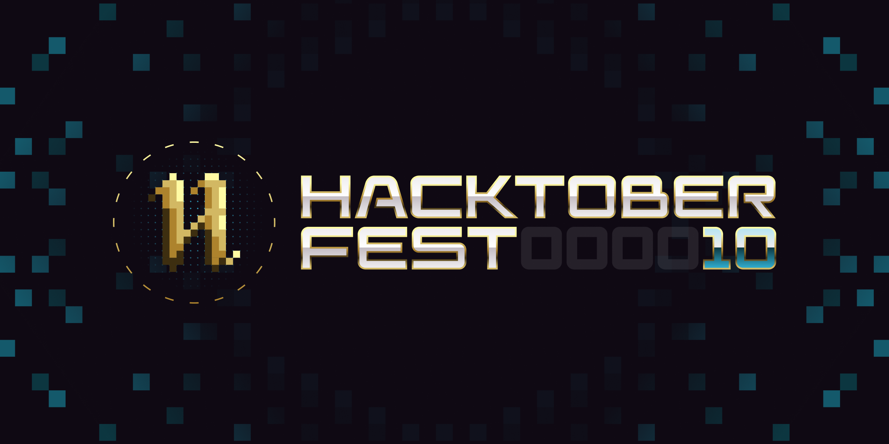

# 🚀 NeoGPT

NeoGPT is a powerful, easy-to-use LLM (Large Language Model) based application designed to perform specific tasks on local systems. Currently RAG (Retrieval Augmented Generation) is supported.

## 🎉 Join Us for Hacktoberfest 2023


## 🚀 Getting Started

To embark on your NeoGPT journey, follow these simple steps:

1. **Installation:** Clone this repository and install the necessary dependencies.


   ```
   git clone https://github.com/neokd/NeoGPT.git
   cd NeoGPT
   pip install -r requirements.txt
    ```

## ✅ To Do
- ✓ RAG (Retrieval Augmented Generation) 
- ✓ FAISS Support
- ☐ User Interface
- ☐ Memory Support for RAG
- ☐ Multilingual Support


## 🌟 Features

- **Task Automation:** NeoGPT can automate a wide range of tasks, from text generation to data analysis, making it a versatile tool for various domains.

- **Local Execution:** NeoGPT runs entirely on your local system, ensuring data privacy and security.

- **User-Friendly Interface:** NeoGPT is designed with a user-friendly command-line interface (CLI) that makes it accessible to users with varying levels of technical expertise.

- **Extensible:** You can easily extend NeoGPT's functionality by adding custom plugins or scripts.

## 🔬 Experimental

Explore our multi-agent bot that generates responses based on a single user prompt. This experimental project showcases the capabilities of NeoGPT.


# 👥 Contributing
We welcome contributions to NeoGPT! If you have ideas for new features or improvements, please open an issue or submit a pull request. For more information, see our [contributing guide](CONTRIBUTING.md).

# 📄 License
This project is licensed under the MIT License - see the [LICENSE](LICENSE) file for details. Let's innovate together! 🤖✨
