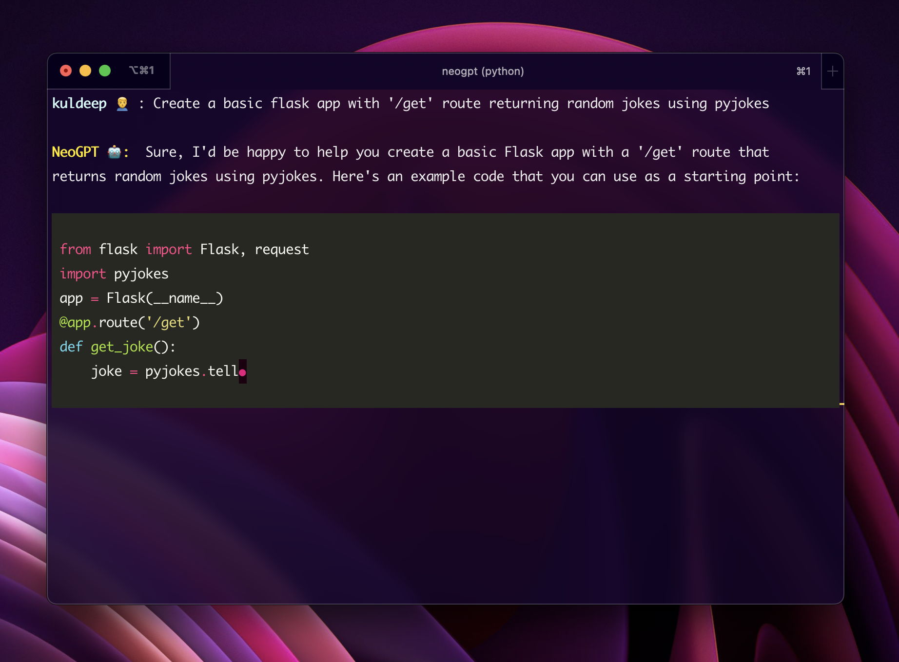

<div align="center">
  <!--  -->
  
<h1 style="font-size: 3em;">NeoGPT 🚀</h1>

  [](https://github.com/neokd/NeoGPT/blob/main/LICENSE)
  [](https://github.com/neokd/NeoGPT/issues)
  [](https://github.com/neokd/NeoGPT/stargazers)
  [](https://github.com/neokd/NeoGPT/network)

</div>


<div align="center">
    <span>
        <a href="https://docs.neogpt.dev/introduction">Documentation</a>
        <span> | </span>
        <a href="https://discord.gg/qNqjsGuCTG">Discord</a>
    </span>
    
</div>

```bash
pip install https://github.com/neokd/NeoGPT/releases/download/v0.1.0/neogpt-0.1.0-py3-none-any.whl
```
> Not working? Read our setup guide [here](https://docs.neogpt.dev/installation)

```bash
$ neogpt
```

# Introduction
NeoGPT is an AI assistant that transforms your local workspace into a powerhouse of productivity from your CLI. With features like code interpretation, multi-RAG support, vision models, and LLM integration, NeoGPT redefines how you work and create. Join the revolution and experience a new era of efficiency with NeoGPT.


NeoGPT is continuously evolving, and your feedback shapes its future. Join our [Discord community](https://discord.gg/qNqjsGuCTG) to stay up to date with the latest developments.


# Table of Contents
- [Getting Started](#getting-started)
- [Features](#features)
- [Contributing](#contributing)
- [License](#license)

## Getting Started

1. **Installation:** Clone this repository and install the necessary dependencies.


    ```
      git clone https://github.com/neokd/NeoGPT.git
      cd NeoGPT/neogpt
      pip install -r requirements.txt
    ```

2. **Building Database** Currently NeoGPT supports local files and Youtube videos. To build the database add your local files to the documents directory and URL in the `builder.url` file. Then run the builder script.

    ```python
       python main.py --build
    ```
    This will create a database file in the `neogpt/db` folder. You can also specify the database to use by using `--db` flag.
    Supported databases are:
    - `Chroma` (default)
    - `FAISS`

    Currently the database is built using 2 papers and 1 youtube video:
    - [Attention Is All You Need](https://arxiv.org/pdf/1706.03762.pdf)
    - [HuggingGPT](https://arxiv.org/pdf/2303.17580.pdf)
    - [22 AI News EXPLAINED!!!](https://www.youtube.com/watch?v=BPknz-hCnec)


3. **Run NeoGPT:** Run the CLI to start using NeoGPT. Requires `Python v3.10`. You can use the `--help` flag to view the available commands and options.
    ```bash
        python main.py
    ```
    You can also use `--ui` flag to run the Streamlit UI.
    ```bash
        python main.py --ui
    ```

4. **Project Documentation:**
    To view the project documentation, run the following command in your terminal or command prompt (Development ⚠️)
    ```bash
        cd docs
        npm i mintlify
        mintlify dev
    ```
    

## Features

- **Code Interpreter:**
    Execute code seamlessly in your local environment with our Code Interpreter. Enjoy the convenience of real-time code execution, all within your personal workspace.

- **Multi RAG Support:**
    NeoGPT supports multiple RAG techniques, enabling you to choose the most suitable model for your needs. It includes local RAG, ensemble RAG, web RAG, and more. 🧠📚

- **Vision:**
   Explore a new dimension as NeoGPT supports vision models like bakllava and llava, enabling you to chat with images using Ollama. 🖼️👁️🧠

- **LLM 🤖:**
   NeoGPT supports multiple LLM models, allowing users to interact with a variety of language models. We support LlamaCpp, Ollama, LM Studio, OpenAI, and Togerther Ai. 🤖🧠📚


## Contributing
We welcome contributions to NeoGPT! If you have ideas for new features or improvements, please open an issue or submit a pull request. For more information, see our [contributing guide](CONTRIBUTING.md).

## License
This project is licensed under the MIT License - see the [LICENSE](LICENSE) file for details. Let's innovate together! 🤖✨


 


 
   
