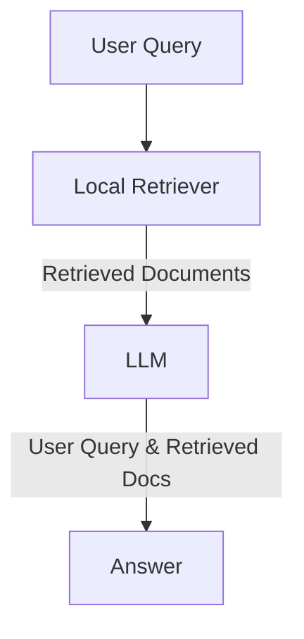

# __Local Retriever__

## Description
The Local Retriever is a basic retriever that retrieves documents from the local vector database and does not reply on the internet. It is the default retriever that is used in NeoGPT. It pulls documents from the local vector database and feeds them into the LLM. It is the fastest and simple retriever among all the retrievers.



<center>*Figure 1: Illustration of Local Retriever in NeoGPT.*</center>

## How to Use
Run the following command to interact with the Local Retriever:

=== "Basic Command"
    ```bash title="Terminal"
    python main.py 
    ```


=== "Local Retriever"
    ```bash title="Terminal"
    python main.py --retriever local
    ```


