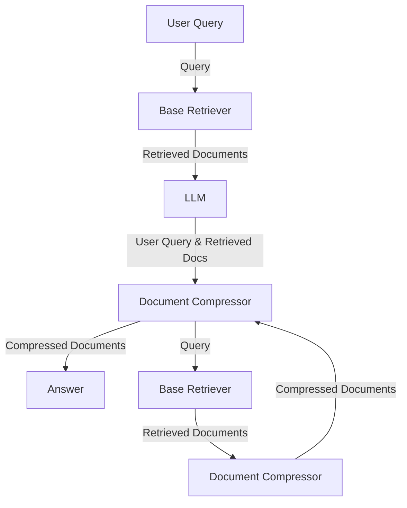

# __Contextual Compressor Retriever__

## Description
The Contextual Compression Retriever is a crucial component within NeoGPT, designed to enhance the efficiency of document retrieval. It optimizes the information presented to a Large Language Model (LLM) by compressing and filtering documents based on the context of a user's query. 

Initially, a Base Retriever fetches relevant documents from a storage system, and these, along with the user's query, are then processed by the LLM. Subsequently, a Document Compressor refines the LLM's output, shortening and filtering documents to create a set of contextually compressed documents. This streamlined information is then seamlessly integrated into the application, ensuring users receive concise and relevant responses aligned with the nuances of their original queries.

*Figure 1: Illustration of Contextual Compressor Retriever in NeoGPT.*

The Contextual Compression Retriever offers notable advantages, enhancing system efficiency, improving the relevance of retrieved content, and optimizing the utilization of the LLM, making it a valuable asset in retrieval-based natural language processing.