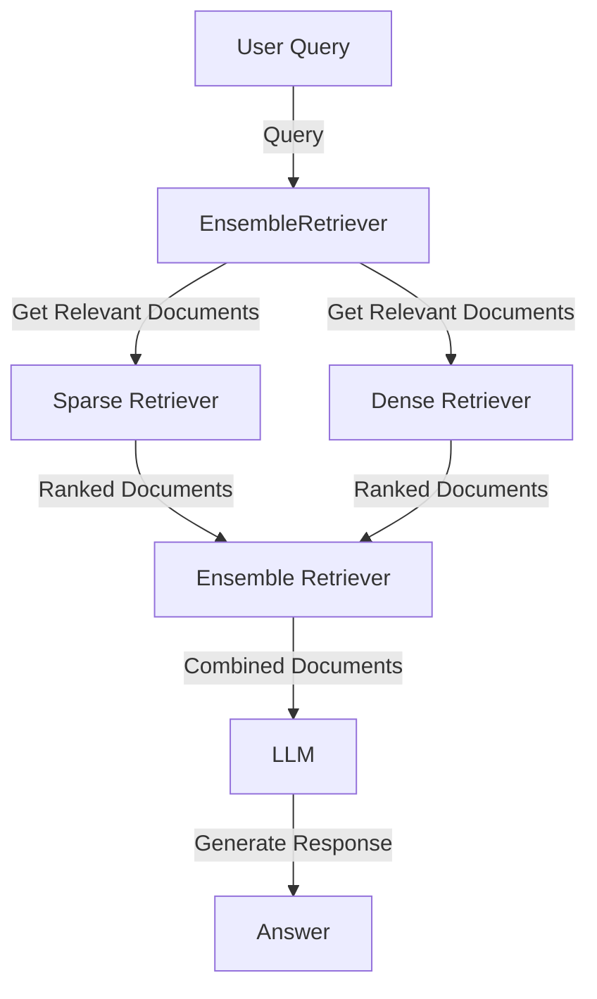

# __Hybrid Retriever__

## Description
The Ensemble Retriever in NeoGPT combines the strengths of different retrieval algorithms to enhance document search. By integrating both sparse retrievers, such as BM25 for keyword-based searches, and dense retrievers, like embedding similarity for semantic understanding, it achieves superior performance compared to individual algorithms. 

This hybrid approach ensures a comprehensive retrieval process, where keyword relevance and semantic context work harmoniously, delivering more accurate and nuanced search results. In essence, the Ensemble Retriever optimizes document retrieval by leveraging the unique advantages of diverse algorithms, resulting in a powerful and adaptive search experience. The hybrid retriever is also known as ensemble retriever. 


<center>*Figure 1: Illustration of Ensemble Retriever in NeoGPT.*</center>

## How to Use
Run the following command to interact with the Ensemble Retriever:

```bash title="Terminal"
python main.py --retriever hybrid
```