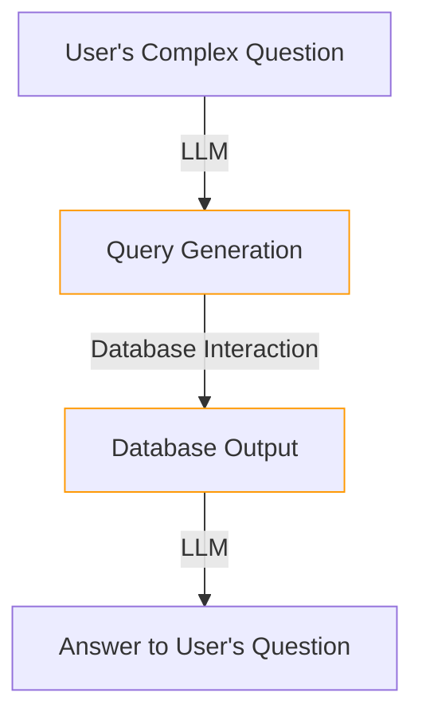

# __SQL Retriever__


## Description

NeoGPT facilitates smooth communication between users and SQL databases through natural language. Typically, data resides in SQL databases, and this retriever empowers users to interact with a SQL database effortlessly using Large Language Models (LLMs). It dynamically constructs and executes SQL queries based on the output generated by the LLM, enhancing the user experience in querying and interacting with database information.

Supported SQL databases:
- MySQL

- PostgreSQL

- SQLite

- Oracle SQL

- Databricks



<center>*Figure 1: Illustration of SQL Retriever in NeoGPT.*</center>

We leverage Langchain's SQL retriever in this project. For additional details, please refer [here](https://python.langchain.com/docs/use_cases/qa_structured/sql){target = "_blank"}.

## How to Use

!!! warning "Builder👷 Warning"
    The SQL retriever is not supported by the builder and does not rely on any of the builder's components or the vector database. It is a standalone retriever that can be used independently.


To interact with a SQL database, follow the steps below:

- Move the SQL database file to the documents folder (Example:  `neogpt/documents/`).
- Run the following command to interact with the SQL database:

```bash title="Terminal"
python main.py --retriever sql
```

After running the command, you will be prompted to enter a question. Enter a question and press `Enter`. The SQL retriever will generate a SQL query based on the question and execute it on the SQL database. The output will be displayed on the terminal.


