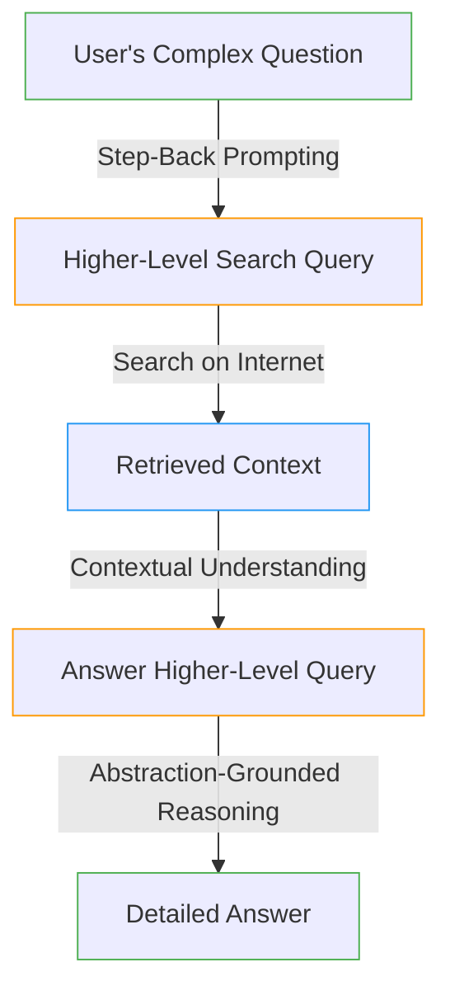

# __Stepback Retriever__

## Description

Step-Back Prompting is a strategic approach tailored for Large Language Models (LLMs) to navigate complex tasks laden with intricate details. It involves a two-step process: first, guiding the LLM to formulate a higher-level, generic question about fundamental concepts; and second, leveraging the facts derived from this abstraction to reason effectively about the original, more detailed question. This method minimizes errors in intermediate steps, enhancing the LLM's ability to retrieve and reason over relevant information accurately.



<center>*Figure 1: Illustration of Step-Back Prompting in NeoGPT.*</center>

The Stepback Retriever, inspired by a prompting technique detailed in the Google DeepMind [paper](https://arxiv.org/pdf/2310.06117.pdf){target = "_blank"}, utilizes these principles to optimize information retrieval and enhance the overall performance of the LLM in tackling challenging tasks. In essence, Step-Back Prompting with Stepback Retriever provides a robust framework for addressing complex queries by strategically navigating through higher-level abstractions.


## How to Use

!!! warning "Builder👷 Warning"
    The Stepback Retriever is not supported by the builder and does not rely on any of the builder's components or the vector database. It is a standalone retriever that can be used independently. It uses Duck Duck Go as the search engine to retrieve relevant documents from the internet.

Run the following command to interact with the Stepback Retriever:

```bash title="Terminal"
python main.py --retriever stepback
```