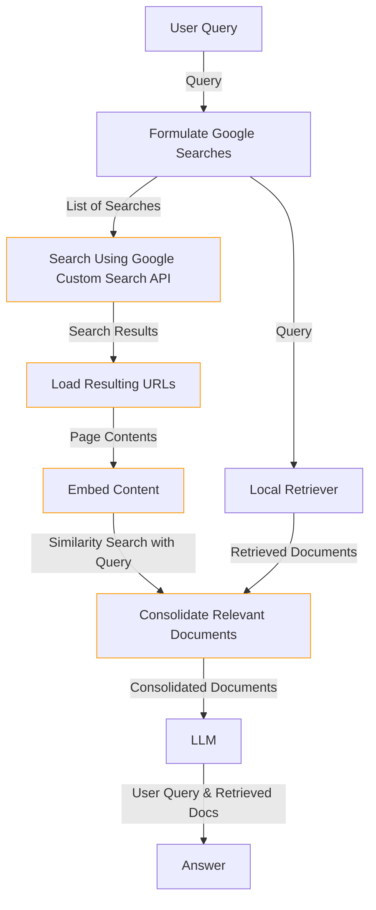

# __Web Research Retriever__

## Description
The Web Research Retriever seamlessly integrates internet and local database sources to fetch documents for NeoGPT. Leveraging the Google Custom Search API, it performs internet searches and retrieves data from the local vector database. The amalgamated information is then fed into NeoGPT's Language Model (LLM). This retriever is ideal for obtaining the latest internet data and retrieving information from the local vector database.

Setting up the Web Research Retriever requires a Google API key and a Google Custom Search Engine ID. For detailed instructions, please refer [here](https://neokd.github.io/NeoGPT/advance/search/).



## How to Use
Run the following command to interact with the Web Research Retriever:

```bash title="Terminal"
python main.py --retriever web
```