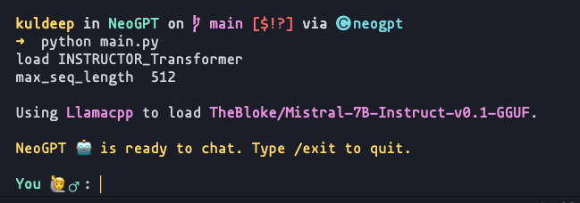

## Basic Setup

<Check>
To get started with NeoGPT, make sure you have completed the [installation](http://localhost:3000/installation#install-with-pip) step.
</Check>


<Steps>
  <Step title="Build the vector store">
    The first step is to build the vector store. This is a one-time process that takes few minutes to complete. The vector store is built using the documents in the `documents` directory. If you want to use your own documents, read the [custom documents](/guides/quick-start#custom-documents) section.

    ```bash Terminal
    python main.py --build
    ```
  </Step>
  <Step title="Run NeoGPT">
    Once the vector store is built, you can run NeoGPT. In the CLI using the following command:

    ```bash Terminal
    python main.py 
    ```
    <Note>
        For the initial startup, this process may take a few minutes if the model has not been downloaded previously.
    </Note>

    Once the model is loaded, you will see the following prompt:

    
  </Step>
</Steps>


## Custom Documents

To use your own documents, you can add them to the `documents` directory. The following formats are supported by NeoGPT:


<AccordionGroup >
    <Accordion title="List of Document Formats" icon="file">
        - **PDF**: `.pdf`
        - **Text**: `.txt`
        - **CSV**: `.csv`
        - **HTML**: `.html`
        - **TSV**: `.tsv`
        - **EML**: `.eml`
        - **EPUB**: `.epub`
        - **Excel**: `.xls`, `.xlsx`
        - **PowerPoint**: `.pptx`, `.ppt`
        - **Word**: `.docx`, `.doc`
        - **Markdown**: `.md`
        - **JSON**: `.json`
    </Accordion>
     <Accordion title="List of Programming Languages" icon="code">
        - **C++**: `.cpp`
        - **Go**: `.go`
        - **Java**: `.java`
        - **Kotlin**: `.kt`
        - **JavaScript**: `.js`
        - **TypeScript**: `.ts`
        - **PHP**: `.php`
        - **Protocol Buffers**: `.proto`
        - **Python**: `.py`
        - **reStructuredText**: `.rst`
        - **Ruby**: `.ruby`
        - **Rust**: `.rs`
        - **Scala**: `.scala`
        - **Swift**: `.swift`
        - **Markdown**: `.markdown`
        - **LaTeX**: `.latex`
        - **HTML**: `.html`
        - **Solidity**: `.sol`
        - **C#**: `.cs`
        - **COBOL**: `.cobol`
    </Accordion>
    <Accordion title="List of Websites" icon="browser">
        - **Youtube**
        - **Default Scrapper**
    </Accordion>
    <Accordion title="List of chat documents" icon="whatsapp">
        - **Whatsapp**
    </Accordion>

</AccordionGroup>


### Adding Youtube Videos

You can add youtube videos to the vector store you can add the urls to `builder.url` file inside the `documents` directory. The following is an example of the `builder.url` file:

```txt builder.url
https://www.youtube.com/watch?v=BPknz-hCnec
```

### Adding Websites

You can add websites to the vector store you can add the urls to `builder.url` file inside the `documents` directory. The following is an example of the `builder.url` file:

```txt builder.url
https://neokd.github.io/NeoGPT/
```
<Tip>
You can add `--recursive` flag to the `--build` command to recursively scrapes all the links in the `builder.url` file.
</Tip>

