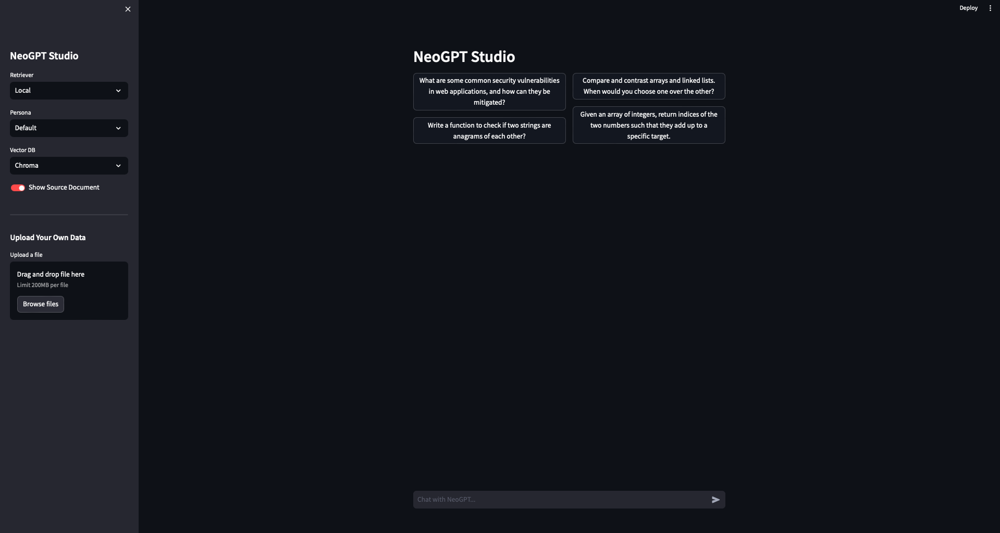

You can chat with NeoGPT through an ChatGPT like interface in your terminal by running `python main.py` after installation

## Features
<CardGroup>

<Card title="Code Interpreter" icon="terminal">
    Execute code seamlessly in your local environment with our Code Interpreter. Enjoy the convenience of real-time code execution, all within your personal workspace.
</Card>

<Card title="RAG Magic" icon="computer" href="">
    NeoGPT supports various RAG models, allowing you to chat with documents, YouTube videos, and social chats. 📚📺📱
</Card>

<Card title="Vision" icon="eye" href="">
    NeoGPT supports vision models like bakllava and llava, enabling you to chat with images using Ollama. 🖼️👁️🧠
</Card>

<Card title="LLM Versatility" icon="brain" href="">
    NeoGPT supports multiple LLM models, allowing users to interact with a variety of language models. We support LlamaCpp, Ollama, LM Studio, OpenAI, and Togerther Ai. 🤖🧠📚
</Card>

</CardGroup>